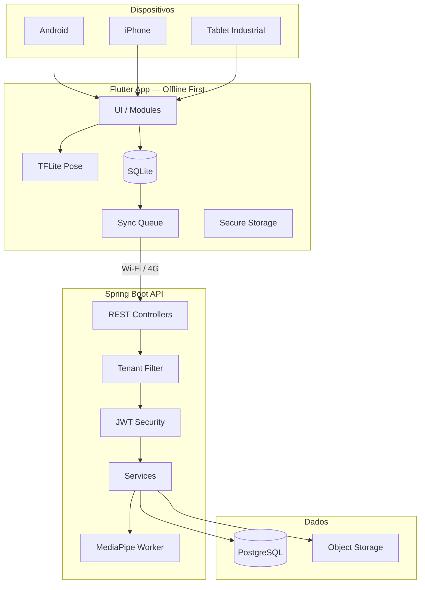
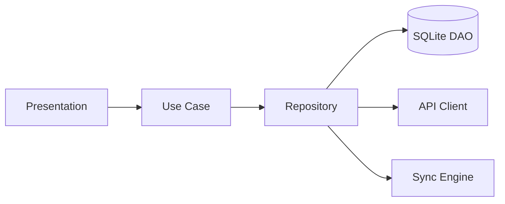
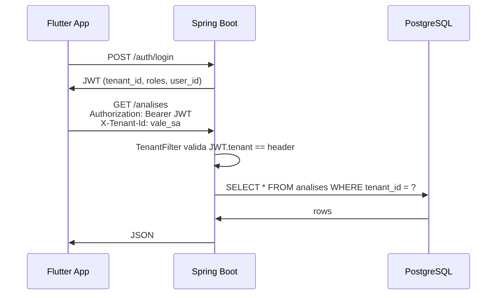
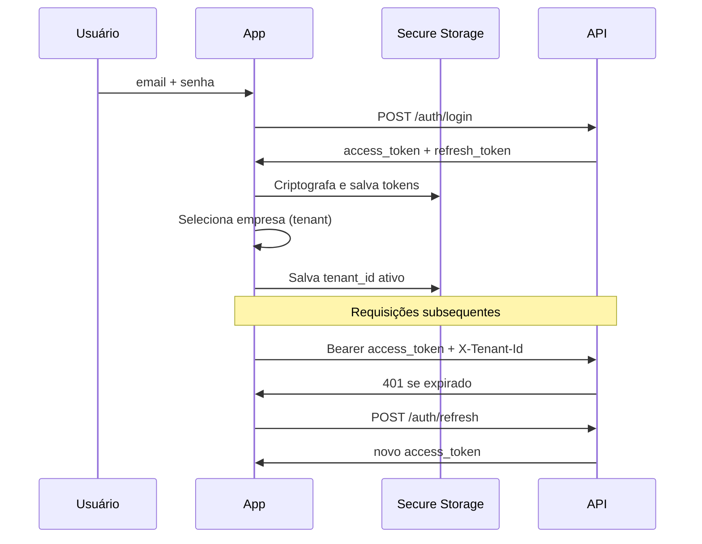
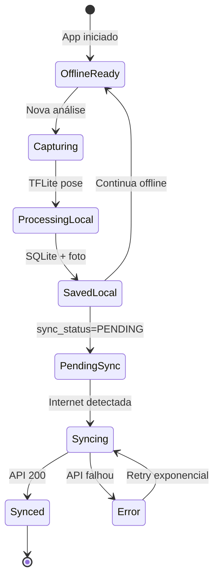
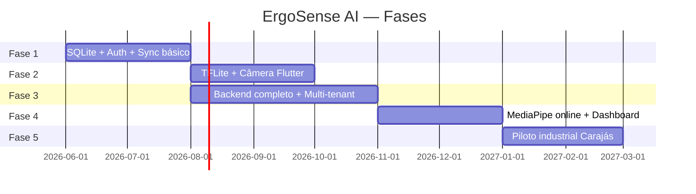

# ErgoSense AI — Arquitetura Completa

> **Roadmap V2.0 (20 módulos, métodos ergonômicos, normas):** [`ERGOSENSE_V2_ROADMAP.md`](ERGOSENSE_V2_ROADMAP.md)  
> **Critérios mestres (Ferramentas Ergonômicas.txt):** [`Ferramentas Ergonômicas.txt`](Ferramentas%20Ergonômicas.txt) → código em `ergosense-app/src/config/ergonomicCriteriaMaster.ts`

## 1. Visão geral



## 2. Objetivo

Aplicativo para **mineração, siderurgia, logística, manutenção e construção pesada** que permite ergonomistas realizarem análises posturais via câmera, com IA local/offline e sincronização posterior.

## 3. Stack

| Camada | Tecnologia |
|--------|------------|
| Mobile | Flutter 3.x, Dart |
| Banco local | SQLite (sqflite / drift) |
| IA offline | TensorFlow Lite + MoveNet/BlazePose |
| IA online | MediaPipe / OpenPose (servidor) |
| Backend | Java 21, Spring Boot 3.x |
| Banco servidor | PostgreSQL 16 |
| Auth | JWT stateless + Refresh Token |
| Storage | S3-compatible (MinIO / AWS) |
| Sync | Event-driven queue + WorkManager |

## 4. Clean Architecture — Mobile

```
mobile/lib/
├── core/           # Config, constants, errors, network, utils
├── modules/        # Feature modules (auth, dashboard, analysis...)
├── services/       # Camera, connectivity, compression
├── database/       # DAOs, migrations, entities SQLite
├── sync/           # Queue, retry, conflict resolver
├── ai/             # TFLite interpreter, pose, scoring
├── auth/           # JWT, secure storage, session
├── shared/         # Models, enums, extensions
├── widgets/        # Design system ErgoSense
└── theme/          # Cores, tipografia (fiel ao protótipo)
```

### Fluxo por módulo



## 5. Clean Architecture — Backend

```
backend/src/main/java/io/ergosense/
├── controller/     # REST endpoints
├── service/        # Regras de negócio
├── repository/     # JPA repositories
├── dto/            # Request/Response DTOs
├── entity/         # JPA entities
├── security/       # JWT, filters, roles
├── tenant/         # Multi-tenancy
├── sync/           # Recebimento batch offline
├── ai/             # Pipeline MediaPipe
├── storage/        # Upload imagens
└── audit/          # Logs e auditoria LGPD
```

## 6. Multi-tenancy



**Regras:**
- Todo registro possui `tenant_id`
- JWT contém `tenant_id` claim
- `TenantFilter` rejeita acesso cross-tenant
- Schema isolado por tenant (opcional fase 2: schema-per-tenant)

## 7. Autenticação



## 8. Fluxo offline / online



**Regra de ouro:** Toda operação de análise completa **100% offline**. Sync é assíncrono e nunca bloqueia UX.

## 9. Sincronização

```
SQLite Local → Queue Sync → API REST → PostgreSQL
```

| Etapa | Descrição |
|-------|-----------|
| 1. Detecção | `connectivity_plus` + WorkManager |
| 2. Fila | Tabela `sincronizacao_pendente` ordenada por prioridade |
| 3. Batch | POST `/sync/push` com lote de entidades |
| 4. Upload | Fotos via multipart comprimido (WebP/JPEG 80%) |
| 5. Pull | GET `/sync/pull?since=timestamp` incremental |
| 6. Conflito | Last-write-wins + log; colaborador: merge manual |
| 7. Retry | 1m → 5m → 15m → 1h (max 10 tentativas) |

Ver [OFFLINE-FIRST.md](sync/OFFLINE-FIRST.md).

## 10. IA — Estratégia híbrida

| Modo | Engine | Quando |
|------|--------|--------|
| Offline | TensorFlow Lite (MoveNet) | Sem internet / config offline |
| Online | MediaPipe servidor | Wi-Fi + análise completa |
| Fallback | TFLite | Online falhou |

Pipeline local:
1. Captura frame(s) da câmera
2. TFLite detecta 33 landmarks
3. Calcula ângulos articulares
4. Aplica RULA / REBA / score 0–100
5. Classifica: BAIXO | MÉDIO | ALTO | CRÍTICO
6. Salva em `resultados_ia` + `fotos_analise`

Ver [AI-STRATEGY.md](ai/AI-STRATEGY.md).

## 11. Dashboard

| Métrica | Fonte |
|---------|-------|
| Análises do mês | `analises` agregado |
| Colaboradores avaliados | `colaboradores` distinct |
| Risco crítico | `resultados_ia.risk_level = CRITICO` |
| Distribuição de risco | GROUP BY risk_level |
| Heatmap setor | JOIN setores + analises |
| Colaboradores críticos | TOP N por score |

Mobile: calculado localmente do SQLite.  
Online: endpoint `/dashboard/stats?tenant_id=`.

## 12. Perfis e permissões

| Perfil | Escopo |
|--------|--------|
| ADMIN_GLOBAL | Todos tenants, config sistema |
| ADMIN_EMPRESA | Um tenant, usuários, setores |
| ERGONOMISTA | Análises, relatórios, colaboradores |
| SUPERVISOR | Visualização setor, alertas |
| OPERADOR | Apenas próprias análises (opcional) |

## 13. Segurança

- JWT HS256/RS256, TTL 15min access / 7d refresh
- Flutter Secure Storage (Keychain / Keystore)
- SQLite criptografado (SQLCipher) — fase 2
- TLS 1.3 obrigatório
- LGPD: consentimento, audit log, direito ao esquecimento
- Imagens: hash SHA-256, retenção configurável

Ver [SECURITY.md](security/SECURITY.md).

## 14. Escalabilidade

| Componente | Estratégia |
|------------|------------|
| API | Horizontal (K8s / ECS) |
| PostgreSQL | Read replicas, particionamento por tenant |
| Imagens | CDN + S3 lifecycle |
| Sync | Filas (SQS/RabbitMQ) para processamento IA |
| Mobile | Milhares de registros offline OK (índices SQLite) |

## 15. Relação com protótipos existentes

| Artefato | Papel |
|----------|-------|
| `index.html` | Design reference (UI/UX) |
| `ergosense-app/` | Web MVP para validação de fluxos |
| `mobile/` | App produção Flutter |
| `backend/` | API produção |

## 16. Roadmap de implementação


