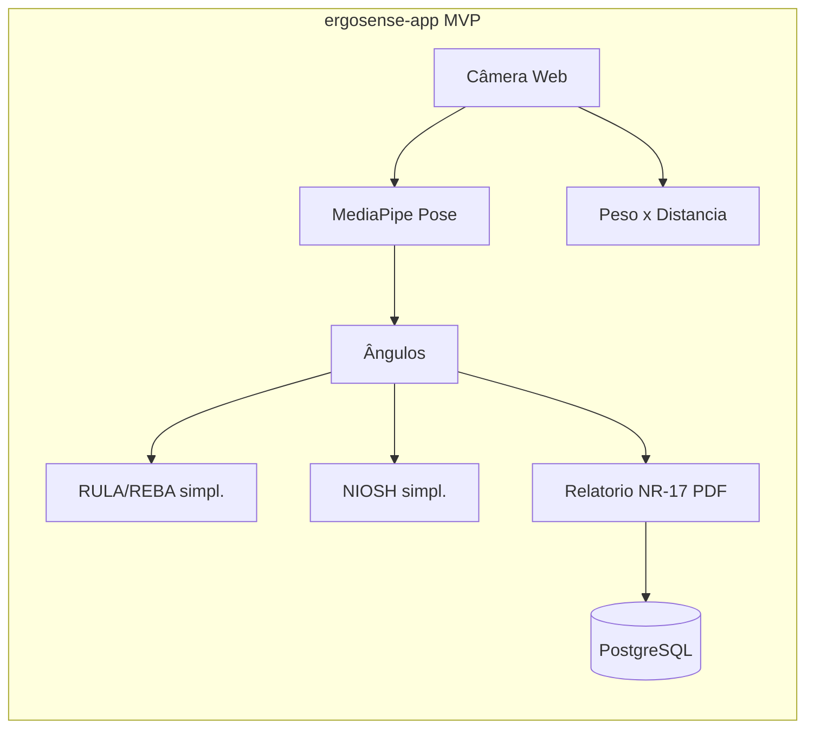
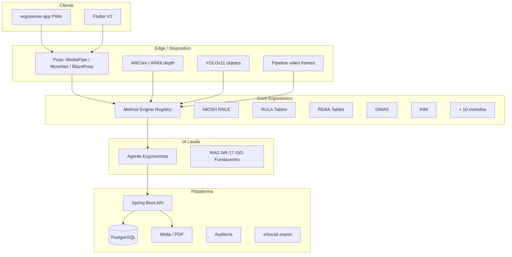

# ErgoSense V2.0 — Plano de Desenvolvimento Completo

Documento mestre para evolução do ErgoSense em plataforma corporativa de avaliação ergonômica com IA, visão computacional, laudos automáticos e gestão de indicadores.

**Fontes internas:** [`Ferramentas Ergonômicas.txt`](Ferramentas%20Ergonômicas.txt), [`ARCHITECTURE.md`](ARCHITECTURE.md), [`ai/AI-STRATEGY.md`](ai/AI-STRATEGY.md), [`security/SECURITY.md`](security/SECURITY.md)

**Fontes normativas (Brasil):**

| Norma / referência | Uso no ErgoSense |
|--------------------|----------------|
| [NR-17 (MTE)](https://www.gov.br/trabalho-e-emprego/pt-br/acesso-a-informacao/participacao-social/conselhos-e-orgaos-colegiados/comissao-tripartite-partitaria-permanente/arquivos/normas-regulamentadoras/nr-17-atualizada-2022.pdf) | Ergonomia, mobiliário, levantamento de cargas, AEP/AET |
| [Portaria MTP 423/2021](https://www.gov.br/trabalho-e-emprego/pt-br/assuntos/inspecao-do-trabalho/seguranca-e-saude-no-trabalho/sst-portarias/2021/portaria-mtp-no-423-nova-nr-17.pdf) | Atualização NR-17 |
| [Manual de Aplicação NR-17 (MTE)](http://www.ergonomia.ufpr.br/MANUAL_NR_17.pdf) | Critérios de posto, mobiliário, organização |
| [NIOSH RNLE (2021)](https://www.cdc.gov/niosh/docs/94-110/default.html) | Equação de levantamento (RWL, LI) |
| NR-15 | Ruído ocupacional |
| NHO-06 (Fundacentro) | Calor — IBUTG |
| NHO-11 (Fundacentro) | Iluminação |
| NR-6 | EPI |
| ISO 11226 | Posturas estáticas |
| ISO 11228-1/2/3 | Movimentação manual |
| eSocial S-2210, S-2220, S-2240 | Eventos SST (futuro) |

> **Aviso legal:** O ErgoSense apoia a decisão técnica; não substitui AET assinada por ergonomista habilitado nem inspeção do trabalho. Todos os limiares do arquivo `Ferramentas Ergonômicas.txt` devem ser versionados e auditáveis.

---

## 1. Objetivo principal (V2)

Permitir avaliação ergonômica via **câmera do celular** (foto/vídeo), com cálculo automático de métodos validados e geração de laudo PDF, reduzindo cálculo manual.

### Métodos alvo (prioridade de produto)

| Método | Status atual (`ergosense-app`) | V2 alvo |
|--------|-------------------------------|---------|
| RULA | Simplificado (`rulaFromAngles`) | Tabelas oficiais completas |
| REBA | Simplificado (`rebaFromAngles`) | Grupos A/B oficiais |
| NIOSH (RNLE) | Parcial (`loadHandling.ts`) | H, V, D, A, F, C → RWL, LI |
| Índice peso×distância | Implementado | Mantido + integração NIOSH |
| OWAS | Não | Classes 1–4 |
| KIM (LSC / PP) | Não | Levantar, segurar, carregar, empurrar, puxar |
| OCRA | Não | Checklist + índice |
| QEC | Não | Exposição % |
| ROSA | Não | Escritório |
| Moore & Garg / RSI revisado | Não | Membros superiores repetitivos |
| TLV HAL | Não | Força × HAL |
| NASA TLX | Não | Questionário |
| HSE-IT | Não | Estresse |
| Snook & Ciriello | Não | Percentil população |
| Análise vídeo | Gravação 2 min | Pipeline multi-frame |
| Antropometria | Não | Percentis + posto |
| Ambientais (ruído, calor, lux) | Não | Entrada manual + sensores |

---

## 2. Baseline técnico (hoje)



**Já implementado:**

- MediaPipe Pose (33 landmarks), overlay esqueleto, sessão 2 min
- Rastreamento distância carga–corpo (`trackLoadDistance.ts`)
- Motor NIOSH simplificado + índice peso×distância
- Relatório NR-17, PDF, multitenant PostgreSQL, planos free/pro
- Flutter/Spring Boot planejados em `mobile/`, `backend/`

**Gaps críticos para V2:**

- RULA/REBA não seguem matrizes completas
- Sem AR (ARCore/ARKit) — precisão ±2 cm exige fase dedicada
- Sem detecção de objetos (YOLO)
- Sem OWAS, KIM, OCRA, ROSA, etc.
- Sem agente IA de laudo técnico
- Sem eSocial / auditoria completa

---

## 3. Catálogo de critérios (de `Ferramentas Ergonômicas.txt`)

Estes limiares devem virar `ergosense-app/src/config/ergonomicCriteriaMaster.ts` (config versionada).

### 3.1 NIOSH — LI e distância horizontal

| Métrica | Faixa | Classificação |
|---------|-------|---------------|
| LI | ≤ 1,0 | Aceitável |
| LI | 1,01–2,99 | Atenção |
| LI | ≥ 3,0 | Alto risco |
| Distância horizontal | ≤ 25 cm | Ideal |
| Distância horizontal | 26–40 cm | Aceitável |
| Distância horizontal | > 40 cm | Crítica |

### 3.2 RULA

| Pontuação | Interpretação |
|-----------|---------------|
| 1–2 | Aceitável |
| 3–4 | Investigar |
| 5–6 | Corrigir em breve |
| 7+ | Correção imediata |

### 3.3 REBA

| Pontuação | Risco |
|-----------|-------|
| 1 | Desprezível |
| 2–3 | Baixo |
| 4–7 | Médio |
| 8–10 | Alto |
| 11–15 | Muito alto |

### 3.4 OWAS, ROSA, OCRA, QEC, KIM, Moore & Garg, RSI, TLV HAL, NASA TLX, HSE-IT

Conforme tabelas no arquivo mestre (seções 4–17 do txt). Implementar como módulos plugáveis com mesma interface:

```typescript
interface ErgonomicMethodResult {
  methodId: string;
  score: number;
  classification: 'aceitavel' | 'atencao' | 'alto' | 'critico';
  inputs: Record<string, number | string>;
  outputs: Record<string, number>;
  normReference: string;
  recommendation: string[];
}
```

### 3.5 Regras automáticas transversais (IA + pose)

| Condição | Ação |
|----------|------|
| Tronco > 60° | Risco alto |
| Tronco > 90° | Risco crítico |
| Pescoço > 20° | Atenção |
| Pescoço > 45° | Crítico |
| Braço acima ombro > 30 s | Crítico |
| Joelho > 90° flexão | Crítico |
| Carga > 23 kg (homem) / 20 kg (mulher) | Disparar NIOSH obrigatório (NR-17 orientação) |
| Distância carga–corpo > 40 cm | Penalidade |
| Frequência > 15 levant./min | Penalidade |
| Postura estática > 60 min | Alerta |

### 3.6 Ambientais

- **Calor (NHO-06):** IBUTG por intensidade (leve ≤30°C, moderado ≤26,7°C, pesado ≤25°C)
- **Ruído (NR-15):** 85 dB(A)/8h, escala até 105 dB(A)/30 min
- **Iluminação (NHO-11):** escritório ≥500 lux; industrial 300–1000 lux

---

## 4. Arquitetura V2 proposta



### 4.1 Registry de métodos

```
ergosense-core/
  methods/
    niosh-rnle/
    rula/
    reba/
    owas/
    kim-lsc/
    kim-pp/
    ocra/
    qec/
    rosa/
    strain-index/
    tlv-hal/
    nasa-tlx/
    environmental/
  criteria/
    ergonomicCriteriaMaster.ts   # espelho do txt
    nr17-checklist.ts
```

Cada método: `validate(inputs) → calculate() → classify() → recommend()`.

### 4.2 Dados (extensão PostgreSQL)

Novas tabelas sugeridas:

- `metodo_ergonomico_resultado` (analise_id, metodo, json_entrada, json_saida, versao_norma)
- `medicao_distancia` (tipo: carga|bancada|monitor|ferramenta, cm, metodo: ar|monocular|tap)
- `objeto_detectado` (classe, bbox, confianca, frame_id)
- `video_analise` (url, frames_processados, resumo_json)
- `antropometria_colaborador` (altura, peso, sexo, percentis_json)
- `ambiental_medicao` (ruido_db, ibutg, lux)
- `auditoria_log` (usuario, entidade, diff_json) — Módulo 19
- `esocial_export` (evento, xml_path, status)

---

## 5. Módulos 1–20 — especificação resumida

### Módulo 1 — Visão computacional

**Stack:** MediaPipe (web), MoveNet/BlazePose (TFLite mobile), TensorFlow.js opcional.

**Entregáveis:**

- Landmarks 33 pontos (já existe)
- Ângulos: lombar, cervical, ombro, cotovelo, punho, quadril, joelho, tornozelo, torção tronco
- Classificação postura: sentado, em pé, agachamento (regras + ML leve)

**Critério de aceite:** FPS ≥ 15 em mid-range Android; repetibilidade ângulo ±5° em bancada de teste.

### Módulo 2 — Medição de distância

**Stack atual:** escala ombros + toque + punhos (`trackLoadDistance.ts`).

**V2:**

- Fase 2A: refinamento monocular (já em curso)
- Fase 2B: ARCore/ARKit para ±2 cm em dispositivos compatíveis
- Tipos: corpo–carga, corpo–bancada, corpo–monitor, corpo–ferramenta

**Saída:** cm, m, confiança, método (`hands` | `tap` | `ar` | `hybrid`).

### Módulo 3 — Reconhecimento de objetos

**Stack:** YOLOv11 ou TensorFlow Lite SSD (caixa, saco, pallet, monitor, cadeira, etc.).

**Uso:** centro da carga automático sem toque; validação contexto escritório/industrial.

### Módulo 4 — NIOSH automático

**Entrada:** peso (manual), H, V, D, A, F, C (V e D da câmera quando possível).

**Saída:** RWL, LI, classificação (aceitável / atenção / crítico).

**Norma:** NIOSH RNLE 2021 + alinhamento NR-17 item 17.5.

### Módulos 5–7 — RULA, REBA, OWAS

Implementar matrizes completas em TypeScript (web) e Dart (mobile), com captura de postura estável (pior postura da sessão ou percentil 90).

### Módulo 8 — KIM

Submódulos: levantar/segurar/carregar; empurrar/puxar. Entradas: peso, frequência, distância, postura (da pose).

### Módulo 9 — ROSA (escritório)

Checklist cadeira + monitor + periféricos; pontuação 1–5+; foto guiada.

### Módulo 10 — Análise de vídeo

Upload vídeo → extração 1–2 fps → agregação posturas + repetição + tempo exposição → relatório sessão.

### Módulo 11 — Agente IA ergonomista

LLM com RAG (NR-17, resultados métodos, Fundacentro). Gera: diagnóstico, conclusão, recomendações, plano de ação. **Revisão humana obrigatória** no fluxo.

### Módulo 12 — Antropometria

Cadastro altura/peso/sexo/idade → percentis (ISO/PNANT) → comparação com alturas de bancada/monitor.

### Módulo 13 — Riscos ambientais

Formulários NR-15, NHO-06, NHO-11; opcional IoT posterior.

### Módulo 14 — Dashboard executivo

KPIs: total avaliações, distribuição risco, ranking setor/função/atividade; gráficos linha/barra/pizza/heatmap.

### Módulo 15 — Laudos automáticos

PDF: empresa, colaborador, fotos, capturas IA, tabelas métodos, recomendações, assinatura digital (ICP-Brasil fase posterior).

### Módulo 16 — Multitenancy

Já existe base; reforçar RLS PostgreSQL, isolamento S3, criptografia em repouso.

### Módulo 17 — eSocial

Export S-2210, S-2220, S-2240 (XML) — requer validação com contador/SESMT.

### Módulo 18 — Mobile nativo

Flutter: offline SQLite, sync, câmera nativa, TFLite, AR opcional.

### Módulo 19 — Auditoria

Log imutável: usuário, data, entidade, campo, valor anterior/novo.

### Módulo 20 — Roadmap futuro

Face, voz, wearables, IoT, APR/PGR/AET auto-gerados — backlog.

---

## 6. Roadmap por fases (realista)

### Status implementação (2026-05-28) — ergosense-app

| Módulo | Status |
|--------|--------|
| 1 Visão computacional | ✅ `vision/enhancedPose.ts` |
| 2 Medição distância | ✅ `distanceTypes`, `arDistance`, `trackLoadDistance` |
| 3 Objetos YOLO/TF | ✅ `objectDetection.ts` + hook |
| 4 NIOSH RNLE | ✅ `methods/nioshRnle.ts` |
| 5 RULA | ✅ tabelas oficiais `methods/rula.ts` |
| 6 REBA | ✅ `methods/reba.ts` |
| 7 OWAS | ✅ `methods/owas.ts` |
| 8 KIM (5 modos) | ✅ `methods/kim.ts` |
| 9 ROSA | ✅ `methods/rosa.ts` |
| 10 Vídeo | ✅ `services/videoAnalysis.ts` |
| 11 Agente IA | ✅ `services/aiErgonomist.ts` |
| 12 Antropometria | ✅ `services/anthropometry.ts` |
| 13 Ambientais | ✅ `services/environmental.ts` |
| 14 Dashboard exec | ✅ `V2ExecutiveDashboardScreen` |
| 15 Laudos PDF | ✅ `exportV2Pdf.ts` |
| 16 Multitenancy | ✅ existente + migração RLS tabelas |
| 17 eSocial | ✅ `esocialExport.ts` |
| 18 Mobile | ✅ scaffold Flutter `mobile/` |
| 19 Auditoria | ✅ `auditLog.ts` |
| 20 Roadmap futuro | ✅ `futureRoadmap.ts` + tela |

### Fase 0 — Estabilização (4–6 semanas) ✅ concluída

- Corrigir fluxo distância + peso + relatório
- Critérios mestres em código (`ergonomicCriteriaMaster.ts`)
- Testes Vitest por método existente
- Documentação API análises

### Fase 1 — Core métodos (3 meses)

- RULA/REBA oficiais
- NIOSH RNLE completo (H,V,D,A,F,C)
- OWAS básico
- Laudo PDF multi-método
- Dashboard v1

### Fase 2 — Visão avançada (3 meses)

- YOLO objetos
- Pipeline vídeo
- ROSA escritório
- KIM LSC + PP
- Agente IA v1 (rascunho laudo)

### Fase 3 — Plataforma corporativa (3 meses)

- Antropometria
- Ambientais (ruído, calor, lux)
- OCRA, QEC, Moore & Garg, TLV HAL, NASA TLX
- Auditoria
- App Flutter beta

### Fase 4 — Compliance & escala (6+ meses)

- ARCore/ARKit precisão
- eSocial
- Assinatura digital ICP
- Wearables / IoT piloto
- Certificação / validação com ergonomista parceiro

---

## 7. Equipe e papéis (RACI simplificado)

| Papel | Responsabilidade V2 |
|-------|---------------------|
| Ergonomista NR-17 | Validação limiares, AET, texto laudo |
| Eng. Segurança | Ambientais, eSocial, SST |
| Dev Full Stack | API, web, PDF, multitenant |
| IA / Visão | Pose, YOLO, vídeo, agente LLM |
| UX/UI | Fluxo câmera, escritório, dashboard |
| BI | Indicadores, heatmap, export Excel |

---

## 8. Métricas de sucesso V2

| KPI | Meta |
|-----|------|
| Tempo médio avaliação completa | < 5 min (foto + peso) |
| Métodos automáticos por sessão | ≥ 5 (RULA, REBA, NIOSH, índice, NR-17) |
| Precisão distância (AR) | ±2 cm em 80% dos dispositivos AR |
| Laudo PDF sem edição manual | ≥ 70% dos casos |
| Conformidade NR-17 checklist | 100% itens mapeados no relatório |

---

## 9. Próximos passos imediatos (sprint atual)

1. Criar `ergonomicCriteriaMaster.ts` a partir de `Ferramentas Ergonômicas.txt`
2. Refatorar `rulaFromAngles` / `rebaFromAngles` → módulos com tabelas oficiais
3. Expandir `loadHandling.ts` para RNLE completa (multiplicadores documentados)
4. Unificar saída laudo: seção por método com referência normativa
5. Abrir épico GitHub/Jira por fase (1 issue por módulo)

---

## 10. Referências complementares (web)

- [NR-17 — Levantamento manual e NIOSH (LF Ergonomia)](https://www.lfergonomia.com/blog/levantamento-manual-cargas-niosh-nr17-limites-peso)
- [NIOSH — Revised lifting equation (2021)](https://www.cdc.gov/niosh/docs/94-110/default.html)
- [ISO 11228-1 — Manual handling](https://www.iso.org/standard/63524.html)
- [Fundacentro — NHOs](https://www.gov.br/fundacentro/pt-br)

---

*Documento gerado para alinhamento ErgoSense V2.0 — revisar com ergonomista responsável antes de uso em laudos legais.*
