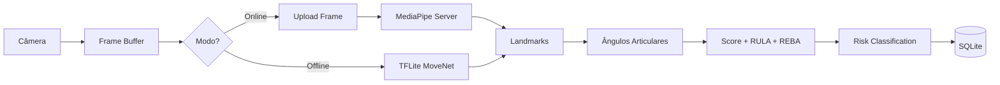

# Estratégia de IA

## Arquitetura híbrida



## TensorFlow Lite (offline)

| Aspecto | Detalhe |
|---------|---------|
| Modelo | MoveNet Lightning / BlazePose lite |
| Input | 256×256 RGB |
| Output | 33 landmarks (x, y, confidence) |
| FPS alvo | 15–30 em dispositivos industriais |
| Tamanho | ~3–6 MB (.tflite) |

### Pipeline Dart

```dart
// mobile/lib/ai/pose_analyzer.dart
class PoseAnalyzer {
  Future<PoseResult> analyze(CameraImage frame) async {
    final input = _preprocess(frame);
    final output = _interpreter.run(input);
    final landmarks = _parseLandmarks(output);
    final angles = JointAngleCalculator.compute(landmarks);
    final score = ErgonomicScorer.score(angles);
    final risk = RiskClassifier.classify(score);
    return PoseResult(landmarks, angles, score, risk);
  }
}
```

## MediaPipe (online)

- Servidor Spring Boot recebe frame(s) ou vídeo curto
- Worker Python/Java com MediaPipe Pose
- Retorna landmarks de maior precisão
- Usado para análise completa e recalibração

## Cálculo ergonômico

| Métrica | Fonte |
|---------|-------|
| Inclinação lombar | Ângulo tronco-vertical |
| Ombro direito | Ângulo braço-tronco |
| Pescoço | Inclinação cervical |
| Cotovelo | Flexão antebraço-braço |
| Repetição/min | Contagem movimentos cíclicos |

## Classificação de risco

| Score | Nível | Ação |
|-------|-------|------|
| 0–34 | BAIXO | Monitorar |
| 35–54 | MÉDIO | Ajustes preventivos |
| 55–74 | ALTO | Intervenção prioritária |
| 75–100 | CRÍTICO | Ação imediata |

## RULA / REBA

Implementados conforme tabelas oficiais a partir dos ângulos detectados.

## Recomendações IA

Geradas por regras + template (fase 1), LLM opcional (fase 2):

- Flexão lombar > 30° → "Reduzir flexão lombar imediatamente"
- Ombro > 90° → "Pausas ergonômicas a cada 30min"
- Score crítico → "Consultar ergonomista sênior (NR17)"

## Fallback

```
Online falhou → TFLite local
TFLite falhou → Análise manual com foto (sem score auto)
```

## Modelos no app

```
mobile/assets/models/
├── movenet_lightning.tflite
├── labels.txt
└── model_metadata.json
```
