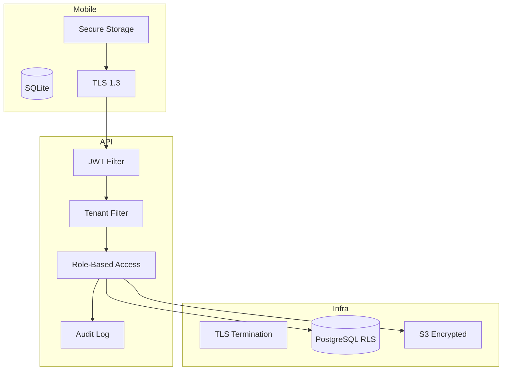

# Segurança e LGPD

## Camadas de segurança



## JWT

| Claim | Descrição |
|-------|-----------|
| `sub` | user_id |
| `tenant_id` | Tenant ativo |
| `roles` | Array de perfis |
| `exp` | Expiração (15 min) |

Refresh token: 7 dias, rotacionado a cada uso, armazenado hashed no servidor.

## Flutter Secure Storage

- Access token
- Refresh token
- tenant_id ativo
- device_id

## Controle por perfil

```java
@PreAuthorize("hasRole('ERGONOMISTA') and @tenantGuard.canAccess(#tenantId)")
public AnalysisDto createAnalysis(String tenantId, AnalysisRequest req) { ... }
```

## LGPD

| Requisito | Implementação |
|-----------|---------------|
| Consentimento | `consentimento_lgpd` + timestamp |
| Acesso aos dados | Export JSON por colaborador |
| Exclusão | Soft delete + purge após 30 dias |
| Auditoria | `audit_log` imutável |
| Minimização | Fotos com retenção configurável |
| Portabilidade | GET `/api/v1/lgpd/export/{colaboradorId}` |

## Criptografia

| Dado | Método |
|------|--------|
| Senha servidor | BCrypt cost 12 |
| SQLite (fase 2) | SQLCipher AES-256 |
| Imagens S3 | SSE-S3 / SSE-KMS |
| Transit | TLS 1.3 only |

## Headers obrigatórios

```
Authorization: Bearer {access_token}
X-Tenant-Id: <tenant_id>
X-Device-Id: {uuid}
X-App-Version: 1.0.0
```
