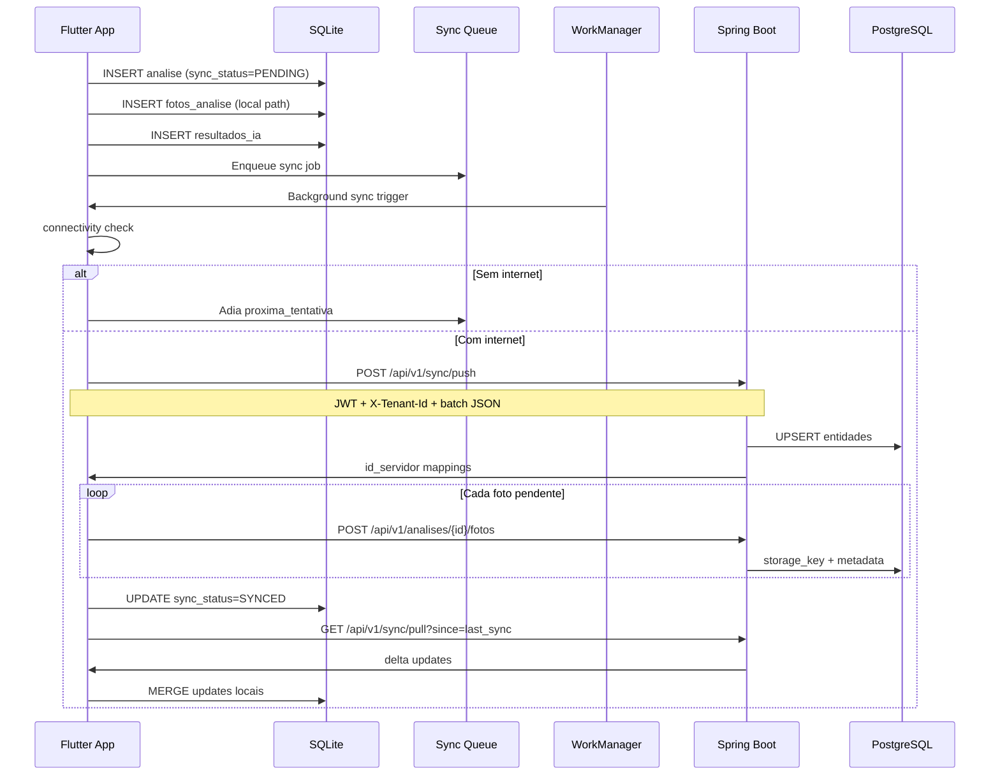

# Sincronização Offline-First

## Fluxo completo



## Estados de sync_status

| Status | Significado |
|--------|-------------|
| `PENDING` | Aguardando envio ao servidor |
| `SYNCED` | Confirmado pelo servidor |
| `ERROR` | Falhou após retries; requer intervenção |

## Prioridades da fila

| Prioridade | Entidade |
|------------|----------|
| 1 | `resultados_ia` (crítico) |
| 3 | `analises` |
| 5 | `fotos_analise` |
| 7 | `colaboradores`, `setores` |
| 9 | `logs` |

## Retry exponencial

```
tentativa 1: +1 min
tentativa 2: +5 min
tentativa 3: +15 min
tentativa 4+: +1 hora
max: 10 tentativas → sync_status=ERROR
```

## Resolução de conflitos

| Cenário | Estratégia |
|---------|------------|
| Análise duplicada (mesmo id_local) | Idempotência no servidor |
| Colaborador editado em 2 devices | Last-write-wins + audit log |
| Foto já enviada (hash igual) | Skip upload |
| Setor deletado no servidor | Soft delete local |

## Compressão de imagens

- Captura: JPEG quality 85%
- Antes upload: resize max 1920px, WebP/JPEG 80%
- Target: < 500KB por foto
- Hash SHA-256 para deduplicação

## Sync incremental (pull)

```
GET /api/v1/sync/pull?since=2026-05-28T00:00:00Z&entities=colaboradores,setores
```

Retorna apenas registros com `updated_at > since` do tenant.

## WorkManager / Background

- **Android**: WorkManager periodic (15min min interval)
- **iOS**: BGTaskScheduler
- Trigger adicional: `connectivity_plus` onConnectivityChanged

## API Sync Endpoints

```
POST   /api/v1/sync/push          # Batch upsert
GET    /api/v1/sync/pull          # Delta download
POST   /api/v1/sync/ack           # Confirma recebimento
GET    /api/v1/sync/status        # Pendentes no servidor
POST   /api/v1/analises/{id}/fotos # Upload multipart
```

## Payload exemplo (push)

```json
{
  "tenantId": "<tenant_id>",
  "deviceId": "uuid-device",
  "batch": [
    {
      "entity": "analises",
      "operation": "CREATE",
      "idLocal": "a-uuid-123",
      "data": { "colaboradorIdLocal": "c-1", "atividade": "Britagem", "..." : "..." },
      "updatedAt": "2026-05-28T21:30:00Z"
    }
  ]
}
```

## Garantias

1. App funciona **100% offline** — sync nunca bloqueia UX
2. Dados locais **nunca são apagados** antes de ACK do servidor
3. Upload de fotos é **resumível** (chunked multipart fase 2)
4. Milhares de análises offline suportadas via índices SQLite
